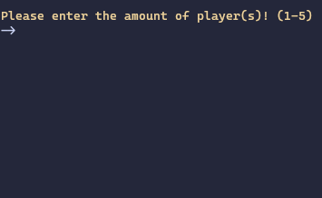

# "The Game" – Engine  
A fast, multithreaded C++ engine for simulating the card game **“The Game”**  
(originally created by Steffen Benndorf and published by NSV).

> ⚠️ Disclaimer  
> This project is an **independent simulation engine**.  
> It contains **no original assets, artwork, text, or rulebook excerpts** from the official game.  
> It is not affiliated with or endorsed by NSV or Steffen Benndorf.

---
## 📼 Demo


---

## 🎯 Purpose

This engine simulates complete rounds of *The Game* to analyze:

- win probability  
- average leftover cards  
- the impact of different player counts  
- how well a deterministic strategy performs  
- statistical behavior over thousands of iterations  

It is designed for speed and clarity, using **multithreading** to distribute simulations across all CPU cores.

---

## 🧠 How It Works

1. The user selects the number of players (1–5).  
2. The user enters the number of simulations (“repetitions”).  
3. The engine simulates an entire play round as many times as entered.
4. Results are aggregated and displayed.

---

## ⚙️ Features

- Supports Windows, Linux and macOS
- Written in C++  
- Multithreaded for maximum performance
- Implements: 
  - Player selection from 1-5
  - ±10 special rule  
  - Prediction of ±10 special rule 
  - Deterministic “best move” strategy 
  - Configurable game/engine rules (include/config.hpp)
- Clean separation of game logic, player logic, and engine logic  
- Command‑line interface  

---

## 🚀 Build & Run

### Requirements
- C++20 or newer  
- g++, clang++, or MSVC  
- CMake

#### Linux / MacOS
```
./build.sh
```
#### Windows
```
cmake -S . -B build -DCMAKE_BUILD_TYPE=Release 
cmake --build build --config Release
.\Release\TGEngine.exe
```
_Windows: If you have any errors or your program doesn't run as expected, opening the project folder in your IDE with necessary extensions installed and running it from there should always work._

---

## 📄 License
This project is licensed under the **MIT** License.  
See the `LICENSE` file for details.
